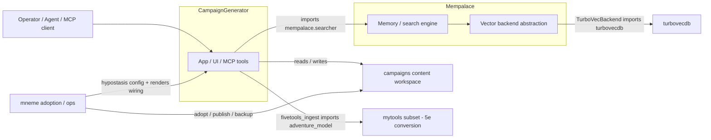

# Campaign Generator System Architecture

> Cross-cutting architecture for the campaign system spanning `CampaignGenerator`, `campaigns`, `Mempalace`, `mneme`, `turbovecdb`, and selected `mytools` modules.
> Source: code-review graph of the workspace, pruned to the active runtime system.
> Owned here in `mneme` because it crosses repo boundaries.

## Subsystems

| Subsystem | Graph-visible modules | Responsibility |
|---|---|---|
| CampaignGenerator | `mcp_server.py`, `server/main.py`, `server/config_service.py`, `campaignlib`, workflow scripts | Application/orchestration: UI/API server, MCP tools, session prep, lore lookup, RPG retrieval, config, generated artifacts |
| campaigns | `Phandalin`, `stormgiants`, `toee`, `out-of-the-abyss`, scripts | Runtime content workspace (mostly markdown/data + small scripts) |
| Mempalace | `mcp_server.py`, `searcher.py`, `palace.py`, `config.py`, `miner.py`, `embedding.py`, backends | Memory engine: mining, collection lifecycle, search, MCP tools, embedding, backend selection, repair, sync |
| turbovecdb | `src/turbovecdb`, `crates/turbovecdb-core`, `crates/turbovecdb-py` | Local vector DB substrate used through Mempalace's `TurboVecBackend` |
| mneme | `mneme/mempalace`, `mneme/mcp`, `hypostasis` | Campaign ownership/adoption, publish/backup/refresh, conformance, host/service config |
| mytools subset | `pdf-translators/adventure_model*` | Peripheral; retained only for 5e/adventure validation on the ingest path |

## Architecture planes

| Plane | Key artifacts / surfaces | Role |
|---|---|---|
| Control plane (wiring) | `refs.yaml`, ingest manifest, palace/backend config, `hypostasis.yaml`, identity, campaign refs | Declares what connects to what |
| Data plane (runtime) | 5etools runtime tree, palace collections, tunnels/hallways, drawers/closets, vector store | Moves/stores content |
| Serving plane (MCP/UI) | CampaignGenerator app + MCP tools, Mempalace MCP server, mneme CLI/MCP | Exposes the system to operators and agents |

## Component graph

## Retained cross-repo edges (graph-confirmed)

| From | To | Evidence |
|---|---|---|
| CampaignGenerator app | Mempalace search | `mcp_server.py` imports `mempalace.searcher`; `quick_search`/`grounded_search` call it |
| CampaignGenerator ingest/retrieval | Mempalace client | `mempalace_client.py` called by `rpg_retriever.run_mempalace`, `fivetools_ingest.ingest_file` |
| Mempalace search | Vector backend | `searcher.py`/`mcp_server.py`/`palace.py` route through backend-backed collections |
| Vector backend | turbovecdb | `Mempalace/mempalace/backends/turbovec.py` imports `turbovecdb`, exposes `TurboVecBackend` |
| mneme mgmt | campaigns | resolves campaign dirs, owns/adopts, publishes, backs up, checks conformance |
| mneme mgmt | hypostasis host config | `mneme/mempalace/cli.py` imports `hypostasis` |
| CampaignGenerator 5e ingest | mytools converters | `fivetools_ingest.py` imports `adventure_model` |

## Primary flows

| Flow | Path | Purpose |
|---|---|---|
| Campaign UI/API startup | `server/main.py::main` → `CampaignConfigService` → routes/frontend | Bootstraps the app around a campaign dir |
| Campaign MCP memory search | `CampaignGenerator/mcp_server.py::{quick_search,grounded_search}` → `_mempalace_search` → `mempalace.searcher` | Campaign tools query memory |
| Mempalace MCP search | `Mempalace/mcp_server.py::tool_search_hierarchical` → `searcher.search_within` → collection query | Hierarchical/flat memory queries |
| Vector backend path | `Mempalace/palace.py::get_collection` → backend registry/config → `TurboVecBackend.get_collection` → `turbovecdb` | Opens selected backend |
| Memory mining | `Mempalace/mcp_server.py::tool_mine` → `miner`/`palace` → backend upsert | Extracts content into searchable memory |
| Campaign adoption | `mneme/cli.py::integrate` / `mneme/mcp/server.py::adopt_campaign` → `ownership.integrate_campaign` | Claims a campaign workspace |
| 5e content ingest | `CampaignGenerator/fivetools_ingest.py` → `adventure_model` → mempalace client/drawers | Validates/converts 5e content |

## Confidence & scope

Subsystems, cross-repo edges, and wiring symbols are graph-confirmed. Concrete on-disk filenames and default paths are, unless stated in the config docs, inferred from loader/writer function/parameter names. The graph intentionally omits large test communities, unrelated repos (`caveman`, `ponytail`), and most `mytools` utilities; campaign markdown/content is runtime data, not code nodes.

## Related docs

- [config-wiring-graph.md](./config-wiring-graph.md) — cross-tool wiring/config layer
- [pruned-campaign-system.md](./pruned-campaign-system.md) — how the runtime system was pruned from the full graph
- CampaignGenerator config docs live in `CampaignGenerator/docs/config/`
- turbovecdb internals live in `turbovecdb/docs/`
