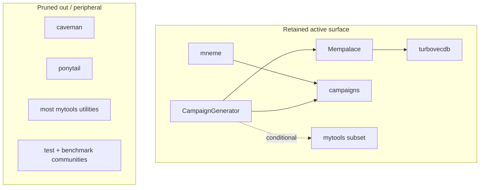

# Pruned Campaign System

> How the runtime campaign system was narrowed from the full workspace graph.
> Scope: combined graph for the workspace, reduced to `CampaignGenerator`, `Mempalace`, `campaigns`, `mneme`, `turbovecdb`, and selected `mytools` code.
> Method: graph communities, imports, caller/callee edges, bridge nodes, hubs, and flows.

Stats: ~1,104 files in the broad graph · 64 communities before pruning · 7 active areas retained · 4 main uncertainty points.

## Pruned active surface

| Area | Repo / boundary | Retained modules | Confidence |
|---|---|---|---|
| Campaign app core | `public/CampaignGenerator` | `campaignlib`, command scripts, `server/main.py`, `server/config_service.py`, frontend/session flows | High |
| Memory/search engine | `public/Mempalace` | `config.py`, `palace.py`, `searcher.py`, `mcp_server.py`, `cli.py`, `miner.py`, `embedding.py`, backends | High |
| Campaign memory integration | `CampaignGenerator → Mempalace` | `mcp_server.py` imports `mempalace.searcher`; `mempalace_client.py`; callers `rpg_retriever`, `fivetools_ingest` | High |
| Campaign workspace/content | `public/campaigns` | `Phandalin`, `stormgiants`, `toee`, `out-of-the-abyss`; scripts (`ui.sh`, `dgx.sh`, ensemble utils) | High |
| Campaign adoption/config | `public/mneme` | `mneme/mempalace`, `hypostasis` — integration, ownership, conformance, publish/backup/refresh, host config | High |
| Vector database backend | `Mempalace → turbovecdb` | `backends/turbovec.py` imports `turbovecdb`; `TurboVecBackend`/`TurboVecCollection` | High |
| 5e tools/adventure validation | `CampaignGenerator + selected mytools` | `fivetools_ingest.py` imports `adventure_model`; providers under `mytools/pdf-translators` | Medium |

## Integration bridges

| Bridge | Graph signal | Interpretation |
|---|---|---|
| `mempalace_client.MempalaceClient` | callers `rpg_retriever.run_mempalace`, `fivetools_ingest.ingest_file` | Process/tool boundary into memory services |
| `CampaignGenerator/mcp_server.py → mempalace.searcher` | `_mempalace_search` called by `quick_search`/`grounded_search` | Direct bridge into Mempalace search |
| `Mempalace/mcp_server.py → searcher.search_within` | `tool_search_hierarchical`, `_shortcut_flat_search`, `search_memories` | Core memory query surface |
| `Mempalace/backends/turbovec.py` | imports `turbovecdb`; `TurboVecBackend`/`TurboVecCollection` | Confirmed backend bridge |
| `CampaignGenerator/server/config_service.py` | caller `server/main.py::main` | UI/API configuration hub |
| `mneme` campaign integration | `_resolve_campaign_dir`, `adopt_campaign`, `integrate_campaign` | Binds campaign trees to palace ownership |
| `fivetools_ingest._load_adventure_model` | called by `validate_adventure_json` | Conditional bridge into mytools |

## Pruned out / peripheral

| Area | Reason |
|---|---|
| `public/caveman`, `public/ponytail` | No integration edges into the campaign cluster |
| Most `mytools` utilities | Independent communities; keep only direct-import/config paths |
| `Mempalace` tests/benchmarks | `tests-palace`, `benchmarks-palace` dominate coupling but don't define runtime shape |
| Repo test communities | `tests-extract`, `unit-runner`, `tests-collection` drive coupling, not architecture |

## Uncertainties to resolve

| Question | Why it remains uncertain |
|---|---|
| Which Mempalace backend is selected at runtime | Backend choice is config-driven, not fully visible in static graph |
| `adventure_model` resolution is name-based | Import appears unqualified; graph resolved similar providers under `mytools/pdf-translators` |
| CLI entrypoint callers | Several `run_*` functions have no graph callers; may be CLI/MCP/subprocess-triggered |
| Campaign content mostly is not code | `campaigns` is a content workspace; most markdown is outside structural analysis |

## Working definition

`CampaignGenerator` orchestrates campaign workflows and exposes UI/MCP surfaces; `campaigns` holds the content workspaces; `Mempalace` provides memory mining, vector search, MCP tools, and backend abstraction; `turbovecdb` is one confirmed vector backend used by `Mempalace`; `mneme` handles campaign adoption and operational management; selected `mytools` code contributes 5e/adventure conversion. Everything else is peripheral unless direct imports, config, or runtime entrypoints prove otherwise.
